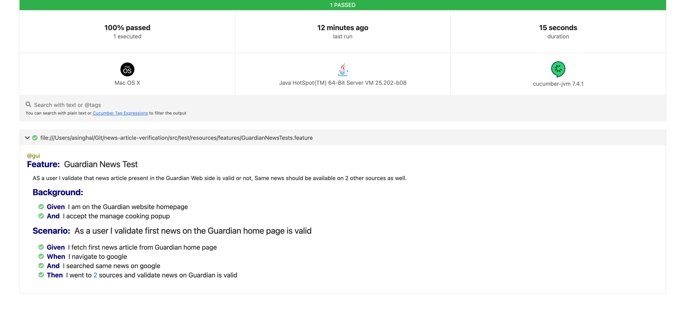

# Guardian News Article verification

---

## Project Purpose

Purpose of this framework is to validate first new article on the 'https://www.theguardian.com/tone/news' is valid. The product
owner wants to start with a simple confirmation by checking other sources to confirm a
news article is valid. For the first news article on https://www.theguardian.com/tone/news
your task is to search google/other resources for similar information to confirm that the
article is valid. If two or more articles exist on Google or another resource then we consider
the first Guardian news article to be valid.

## Tools and Libraries

This project using 2 main tools, Selenium, Java and Cucumber. On the other hand, I used some supportive tools. 
The complete list of tools, you can see in the `pom.xml` file.

## Requirements

* Java Development Kit
* Maven
* WebDriver, using ChromeDriver

## Running Tests

* Clone the repository from your fork to this directory
* Open the project using any Java IDE
* Run the tests with the script below

```shell
$ mvn clean install
```

## Test Results

* Test report automatically generated on `target` folder after finished the test execution
* Report Path target/cucumber-report/cucumber.htmls



# Automation Execution
* Use the runner file for executing the test cases. src/test/java/runners/TestRunner